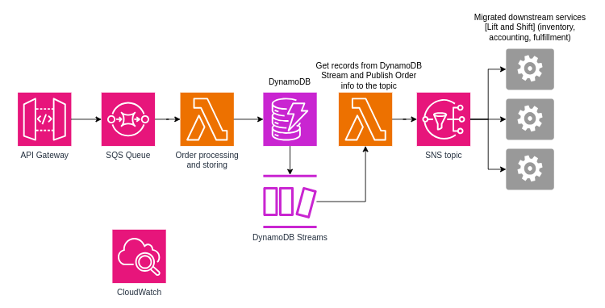
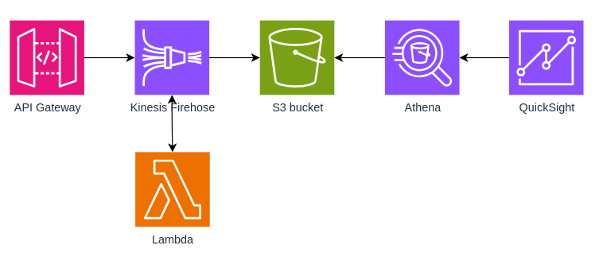
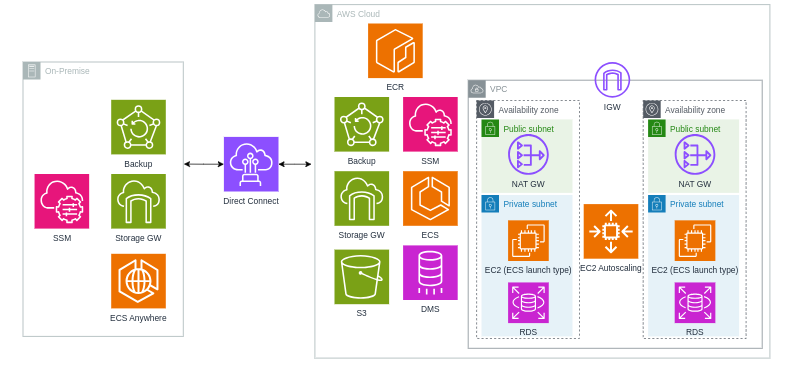
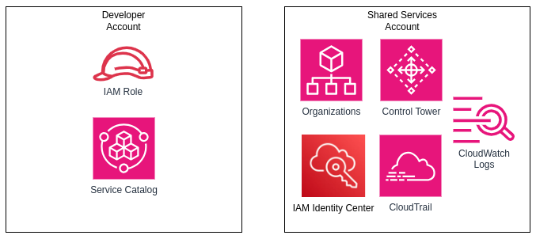
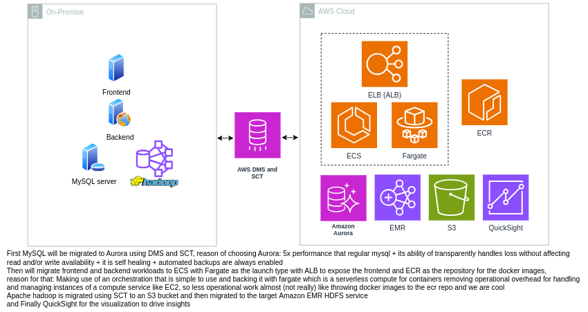

## Exercise 1 - Migrating and refactoring orders service of an e-commerce app
- Have managed scaling as much as possible
- Decoupling solution components to maximize resilience
- Have centralized monitoring and logging
### Proposed Solution:

## Exercise 2 - Data analytics solution for a menu website
- Provide HTTPS endpoint for data collection
- Prefer using AWS managed services as there is shortage in staff
- Prefer services with per-usage billing, not per-time billing
- Have cross-region data replication and encryption
- Use different storage classes to save on cost and encryption
### Proposed Solution:

- Firehose for data ingestion
- S3, cross-region replication (CRR)
- S3 intelligent tiering enabled
- Lambda to transform the data
- Athena to have interactive query service that you can use to analyze data in S3 by using SQL and you pay only for the queries that you run
- Choosing QuickSight over managed-grafana because of the shortage in staff and they already know how to use QuickSight

## Exercise 3 - Migrating workloads and Hybrid deployment
### Proposed Solution:

- RDS in this diagram is a multi-AZ deployment of RDS

## Exercise 4 - Organizing a chaotic prod situation into a manageable one of a start-up that creates and hosts webapps for customers
- Devise a plan for how to manage multiple AWS accounts
- Create an account that users will initially sign in to
- Configure single sign-on and centralized credentialing
- Enforce configuration rules across AWS accounts and enforce config standards for newly created accounts
- Centralized logging in a dedicated account
### Proposed Solution:

- OUs for different functions/teams and also for different environments, applying SCPs accordingly
- IAM identity center provides SSO across different accounts
- Control tower to automate account provisioning, automating the process of launching stuff in the account using IaC and in our case service catalog will be one
- Cloudtrail monitors and records account activity across our AWS infrastructure
- Service catalog to create and manage pre-approved portfolios and products in an account (infrastructure vending machine for the devs)

## Capstone project
Scenario: You are working for a customer that runs their workloads on premises. Your customer has two workloads:

A three-tier architecture composed of a frontend (HTML, CSS, JavaScript), backend (Apache Web Server and a Java application), and database (MySQL). The three-tier application hosts a dynamic website that accepts user traffic from the internet.

A data analytics workload that runs Apache Hadoop. The analytics workload analyzes a massive amount of data that stored on premises and it also uses visualization tools to derive insights.

These components are currently running in the data center on physical servers. Currently, if a power outage occurred in the data center, all systems would be brought offline. Because of this issue (in addition to other benefits of the cloud), your customer wants to migrate all components to the cloud and, when possible, use AWS services to replace on-premises components.

### Proposed Solution:

Graded: 8 out of 8

